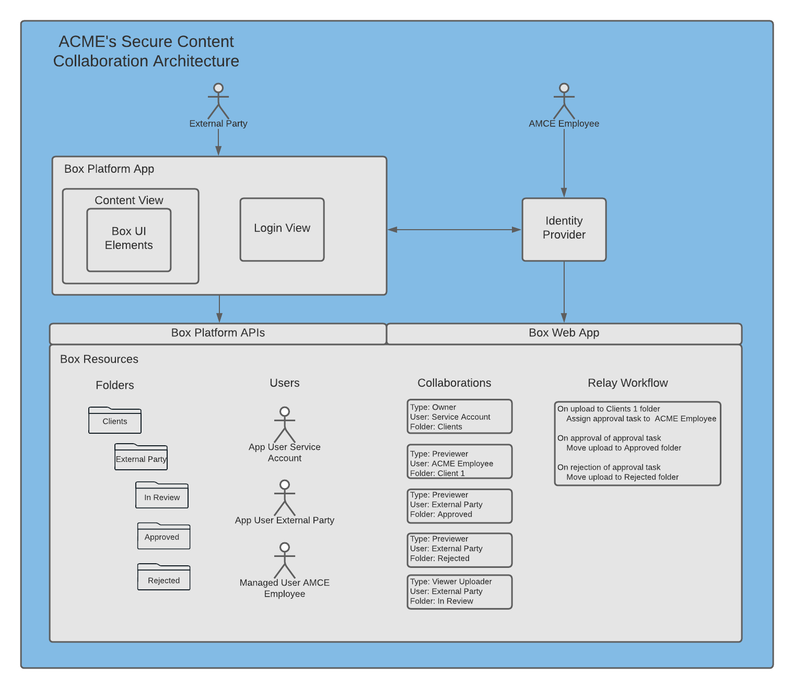
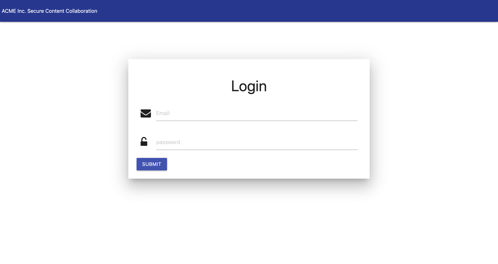
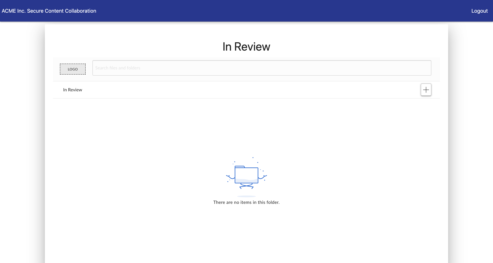
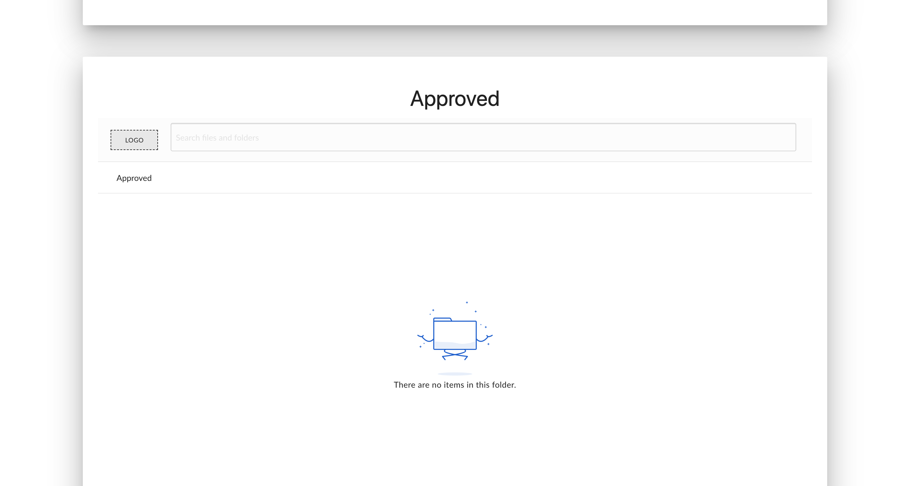
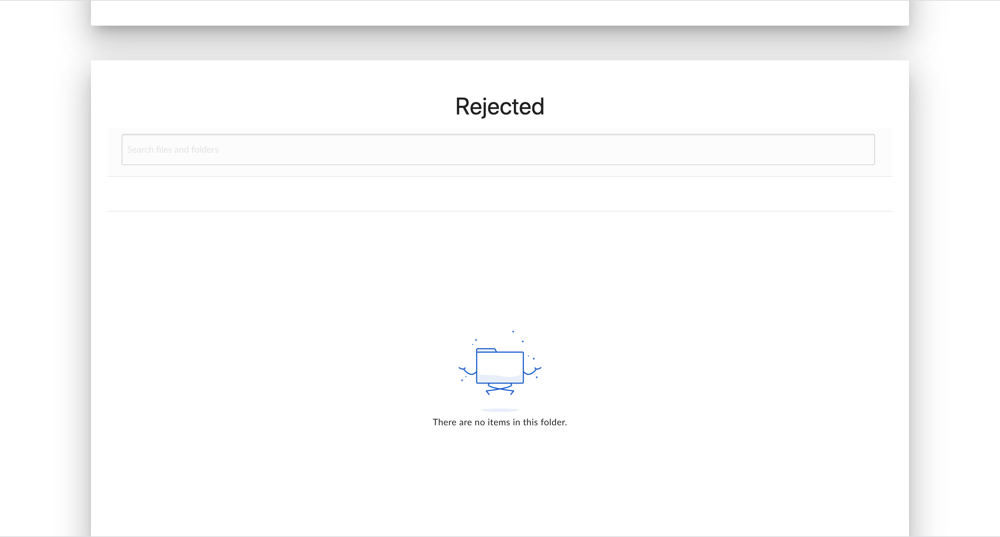

## BoxWorks 2020 - Box Platform Integration Best Practices  
### Architecture Diagram  
  
### UI  
#### Login View  
  
#### Content View  

  
 
### Set up and Run  
1. From the project root folder, create a Python 3.6+ virtual environment  
`$ virtualenv --python=python3 env`  
2. Activate the virtual environment  
`$ source env/bin/activate`  
3. Install the project dependencies  
`$ pip install -r requirements.txt`  
4. Create a file at the project root folder called `box_jwt_keys.yml` and add your Box Platform JWT keys  
5. Set the `FLASK_APP` environment variable referencing the flask app instance  
`$ export FLASK_APP=src/main:flask_app`  
6. Bootstrap the Box environment  
`$ flask set_up_box_environment`  
7. Add the 'In Review', 'Approved' and 'Rejected' folder IDs to the IDP constant on line 18 of `src/utils.py`  
8. Run the development server  
`$ flask run` 
9. From a browser, open `127.0.0.1:5000/content/login/`  
10. Login with email `drodgers@box.com` password `Welcome2020`
### Set up and Run with Docker  
1. From the project root folder, set the `FLASK_APP` environment variable referencing the flask app instance  
`$ export FLASK_APP=src/main:flask_app`  
2. Bootstrap the Box environment  
`$ flask set_up_box_environment`  
3. Add the 'In Review', 'Approved' and 'Rejected' folder IDs to the IDP constant in `src/utils.py`  
4. Build and run the development Docker image  
`$ make dev`  
5. From a browser, open `127.0.0.1:5000/content/login/`  
6. Login with email `drodgers@box.com` password `Welcome2020`